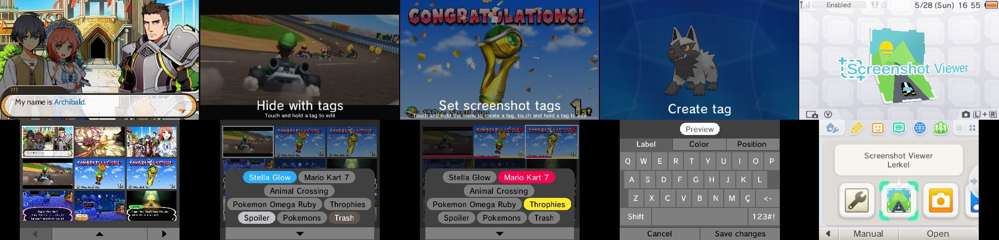
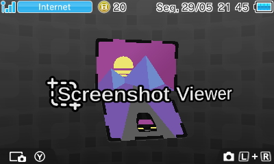

# 

Simple homebrew app for viewing screenshots taken with Luma3DS

## Features

- 3D/Stereoscopic Support
- Tagging System
  - Organize your screenshots by hiding, filtering, and sorting with tags.
- Delete screenshots directly from the app.

## Building

### Dependencies

- [devkitPro](https://devkitpro.org/wiki/Getting_Started)
- [makerom](https://github.com/3DSGuy/Project_CTR/releases) (add to PATH)
- [bannertool](https://github.com/Steveice10/bannertool/releases) (add to PATH)

### Make Commands

- `make`
  - Build the app as .cia, .3ds and .3dsx to `./output`
  - Run `make DARK=true` to build the app with dark banner and icon 
 
Preview

  
  

- `make 3dsx cia elf 3ds`
  - Build the app as the specified format to `./output`
- `make citra CITRA="path to citra.exe"`
  - Build the app as .3dsx and run it with citra
- `make clean`
  - Remove the `./build` and `./output` folders
